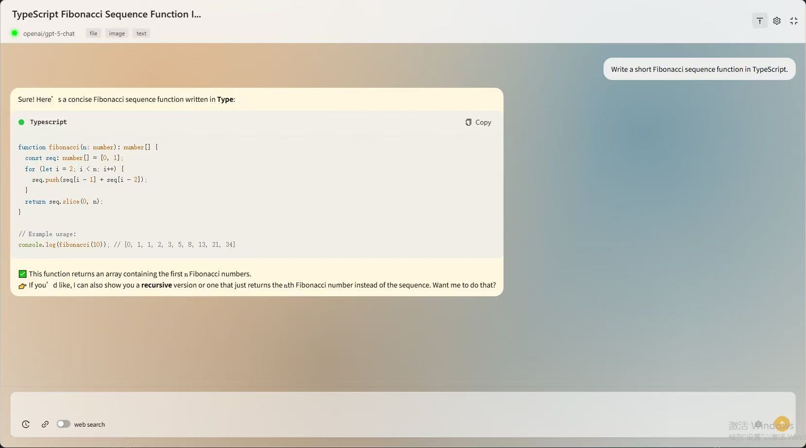

  

<h1 align="center">Tauri + OpenRouter GPT Client</h1>

  <em>Beautiful · Handy · Powerful — A sleek, tiny, and powerful GPT desktop client</em>

  <a href="#english">English</a> ·
  <a href="#中文">中文</a>

---

## English

<strong>Show/Hide English</strong>

### 📸 Screenshots

<table>
  <tr>
    <td></td>
    <td></td>
  </tr>
</table>

  <em>
    The LLM landscape is fiercely competitive, and I often switch between models to find the best fit for my task. 
    I didn’t want to pay $20/month for several subscriptions. Then I found <b>OpenRouter</b> — a provider that lets you access most major models at their original prices with a single API key. 
    There’s no official desktop client yet, so I built this <b>GPT desktop client</b>. 
    Just purchase an API key on OpenRouter (Alipay supported), paste it in the app, and you’re good to go. I do not charge any in-app fees — enjoy!
  </em>

---

### ✨ Highlights

- 🎨 **Beautiful UI**
- 🔁 **Switch among hundreds of models**
- 🌊 **Streaming responses**
- 🧱 **Native code block rendering**
- 🗂️ **Rich input media support**
- 🪟 **Floating window**
- 🌍 **30 system languages**
- 🕰️ **Conversation history**
- 🔎 **Web search**
- 🧩 **Prompt management**
- 📦 **Tiny installer**
- 🖥️ **Cross-platform (Windows / macOS / Linux)**

---

### 🚀 Quick Start

#### 1) Download & Install
- Grab the installer for your OS from **Releases** (tiny size, fast startup).
- Windows: **.msi / .exe**; macOS: **.dmg / .app**; Linux: **.AppImage / .deb / .rpm**.

> Built with Tauri on the system WebView — low resource usage and instant launch.

#### 💡 Windows Tips
- ✅ **Prefer installers**: Use `.msi` or `.exe`.
- 🧩 **WebView2 runtime**: Usually present on Windows 10+. If the app window is blank or errors at first run, install the Microsoft Edge WebView2 Runtime and retry.
- 🛡️ **SmartScreen**: If you see “Windows protected your PC”, click **“More info” → “Run anyway”**.
- 🌐 **Network access**: Allow the app through firewall prompts for online features.

> Still seeing UI/launch issues? Update GPU drivers or try running on the discrete GPU.

#### 2) Configure OpenRouter
1. Open **Settings → API-KEY** (or the first-run setup wizard).  
2. Paste your **OpenRouter API Key**.  
3. Pick a default model (switch anytime).

> A popular model list is built-in; you can also enter any available model name manually.

#### 3) Start Chatting
- Type normally or drag files into the window/floating panel  
- `/` for **prompt templates**, `@` for **actions**  
- `Ctrl/⌘ + Enter` to send, `Shift + Enter` for newline

---

### 📋 Why so tiny?

- **Tauri** + native WebView  
- Minimal dependencies  
- Fast startup, low memory footprint

---

### 📬 Contact

Feature ideas or found a bug? I’d love to hear from you:  
**tzacoltheeagle@gmail.com**

---

### 📝 License

GPL-3.0

---

### ⭐ Star & Share

If you like this project, please **Star** ⭐ and share — thanks!

---

## 中文

<strong>展开/收起 中文</strong>

### 📸 截图

<table>
  <tr>
    <td></td>
    <td></td>
  </tr>
</table>

  <em>
    现在的 LLM 竞争异常激烈，我常常需要在多个模型之间切换，以便为当下任务选择最合适的那个。 
    但我并不想为不同模型分别支付每月 20 美金的订阅费用。直到我发现了 <b>OpenRouter</b> —— 你可以用一个 API Key、以原价调用几乎所有主流大模型的服务商。 
    他们虽未推出官方桌面客户端，但我已经迫不及待，于是开发了这款 <b>GPT 桌面客户端</b>。 
    你只需在 OpenRouter 官网购买 API Key（支持支付宝），在应用内粘贴配置即可开始使用；本人不会在应用内收取任何费用。现在就享受它吧！
  </em>

---

### ✨ 核心特性

- 🎨 **优雅美观的 UI**
- 🔁 **支持数百个模型自由切换**
- 🌊 **流式响应**
- 🧱 **原生代码块渲染**
- 🗂️ **多种输入媒体支持**
- 🪟 **悬浮窗**
- 🌍 **30 种系统语言**
- 🕰️ **历史记录**
- 🔎 **联网搜索**
- 🧩 **提示词管理**
- 📦 **超小安装包**
- 🖥️ **跨平台（Windows / macOS / Linux）**

---

### 🚀 快速上手

#### 1) 下载与安装
- 前往 **Releases** 页面下载对应平台的安装包（体积小、启动快）。
- Windows 使用 **.msi / .exe**；macOS 使用 **.dmg / .app**；Linux 使用 **.AppImage / .deb / .rpm**。

> Tauri 基于系统 WebView，资源占用低、启动飞快。

#### 💡 Windows 平台提示
- ✅ **优先使用安装包**：`.msi` 或 `.exe`。  
- 🧩 **WebView2 运行时**：Windows 10+ 通常已内置；若首次启动空白或报错，请安装 Microsoft Edge WebView2 Runtime 后重试。  
- 🛡️ **SmartScreen 提示**：如遇“Windows 保护你的电脑”，点击 **“更多信息” → “仍要运行”**。  
- 🌐 **联网权限**：首次使用联网搜索等功能时，如弹出防火墙提示，请允许应用访问网络。

> 若仍有启动/显示问题，可尝试更新显卡驱动或切换到独显运行。

#### 2) 配置 OpenRouter Key
1. 在应用内打开 **设置 → API-KEY**（或首次启动的引导页）  
2. 粘贴你的 **OpenRouter API Key**  
3. 选择默认模型（可随时切换）

> 内置热门模型清单，也支持手动输入任意可用模型名称。

#### 3) 开始对话
- 直接输入问题，或拖拽文件到窗口/悬浮窗  
- 使用 `/` 呼出**提示词模板**，或 `@` 选择**常用指令**  
- `Ctrl/⌘ + Enter` 发送，`Shift + Enter` 换行

---

### 📋 为什么这么小？

- **Tauri** + 原生 WebView  
- 依赖极简  
- 启动快、内存占用低

---

### 📬 交流与反馈

欢迎提交**功能建议**或**Bug 反馈**：  
**tzacoltheeagle@gmail.com**

---

### 📝 许可

GPL-3.0

---

### ⭐ Star & Share

如果这个项目对你有帮助，欢迎 **Star** ⭐ 并分享给同事朋友！

